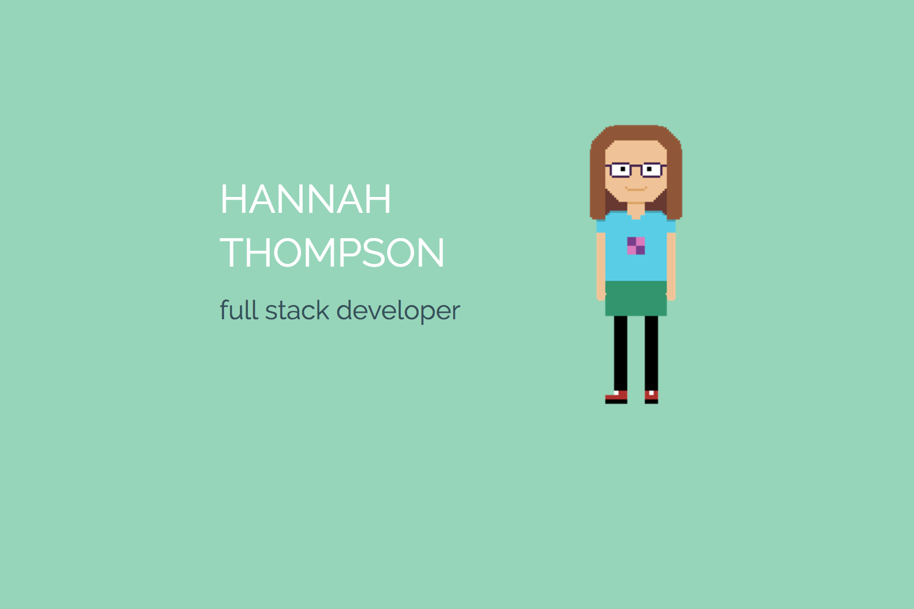

# Portfolio

This portfolio was developed for the first major assignment at Coder Factory Academy.

## Project Requirements

* Built in Ruby on Rails
* Using CSS and HTML for design
* Minimal javascript
* Needed a design and planning process

## Run the site

To run, ensure you have Ruby installed. This site is developed in Ruby 2.4.0.

Clone this repository and run

$``bundle install`` to install all Gems

$``rails s`` to start the server.

Once the server is up and running navigate to
`` localhost:3000``

## Features

* Responsive design optimised for mobile and desktop
* Easy to update, with the majority of content held in arrays in pages_controller.rb and generated into html by ruby loops
* Additional content automatically fits to screen by utilising flexbox containers.
* The design reflects my personality - I wanted it to be colourful, fun and feminine rather than flashy or edgey (I'm not a very edgey person!)
* The pixel images are created by myself in [Aseprite](https://www.aseprite.org/).
* The gopher Go image was created by Renee French.

## Design Process

1. I created a [Pintrest board](http://pin.it/RmA1qHl) to collect designs and colour schemes that I found inspiring.

2. I then mocked up my design in [Canva](https://www.canva.com/design/DACOnJl2wCU/iM54dwBExAmqY5QusBeDUQ/view?utm_content=DACOnJl2wCU&utm_campaign=designshare&utm_medium=link&utm_source=sharebutton).

3. Finally, I created a [Trello board](https://trello.com/b/PVKNaPGz/portfolio) to track content.
